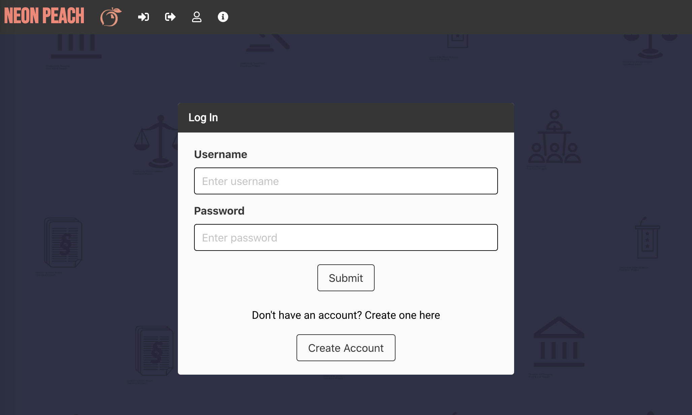

# NEON Peach

\*[Description](#Description)

\*[User-Story](#User-Story)

\*[Installation](#Installation)

\*[Usage](#Usage)

\*[Contributing](#Contributing)

\*[Testing](#Testing)

\*[License](#License)

## Description

NEON Peach utilizes node, express, express-handlebars, express-session, handlebars, mysql2, sequelize, passport, passport-local, and the Bulma CDN to build an application that allows users to create an account, login to their account, and interact with current Georgia legislation.

## User Story

As a GA citizen, I want a platform that allows me to easily research and interact with state legislation to influence the public policies that affect me.

- USER will CREATE an account
- USER will login
- USER can UPDATE all fields
- USER can DELETE account
- USER can VIEW current proposed legislation

To view the final application demo, please use this link:

- https://neon-peach.herokuapp.com/

# Installation

The code for NEON peach can be found on github using the following link:

- https://github.com/loisgabor/project-2-legislations

Once the code is forked and cloned to your computer, you will need to run `npm install` to install the packages associated with this application.

# Usage

NEON Peach uses node, express, express-handlebars, express-session, handlebars, mysql2, sequelize, passport, passport-local, and the Bulma CDN to create and store data for the application.

The application uses a laws_db to store user information

# Contributing

- [Garrett Walker](https://github.com/garrettwalter)
- [Lois Simonca](https://github.com/loisgabor)
- [Rocco Maniscalco](https://github.com/roccomaniscalco)
- [Shelby Andersen](https://github.com/shelbyandersen)

# Testing

To test this application you will need to fork the repo here:

- https://github.com/loisgabor/project-2-legislations

Then, run `node server.js` to begin the application in your integrated terminal.

# License

MIT License

Copyright (c) [2020] [Shelby Andersen]

Permission is hereby granted, free of charge, to any person obtaining a copy of this software and associated documentation files (the "Software"), to deal in the Software without restriction, including without limitation the rights to use, copy, modify, merge, publish, distribute, sublicense, and/or sell copies of the Software, and to permit persons to whom the Software is furnished to do so, subject to the following conditions: The above copyright notice and this permission notice shall be included in all copies or substantial portions of the Software.

THE SOFTWARE IS PROVIDED "AS IS", WITHOUT WARRANTY OF ANY KIND, EXPRESS OR IMPLIED, INCLUDING BUT NOT LIMITED TO THE WARRANTIES OF MERCHANTABILITY, FITNESS FOR A PARTICULAR PURPOSE AND NONINFRINGEMENT. IN NO EVENT SHALL THE AUTHORS OR COPYRIGHT HOLDERS BE LIABLE FOR ANY CLAIM, DAMAGES OR OTHER LIABILITY, WHETHER IN AN ACTION OF CONTRACT, TORT OR OTHERWISE, ARISING FROM, OUT OF OR IN CONNECTION WITH THE SOFTWARE OR THE USE OR OTHER DEALINGS IN THE SOFTWARE.

© 2020 NEON Peach
